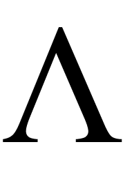

# [Lambda]

	

## Description
Une bibliothèque servant à modéliser à l'aide de graphiques des concepts abstrait lié au mathématique plus précisément
des branches traitant de l'algèbre et de l'algèbre linéaire. L'utilisation de la géométrie euclidienne me permet de me faire
une représentation visuel de sujet qui peuvent être difficile à _imager_ dans sa tête.

### Outil pédagoque
Ce projet me sert également à travailler mon habilité à transposer un problème logique et mathématique sous la forme d'un algorithme, à améliorer ma capacité à modéliser des concepts en utilisant la programmation orientée objet, à mettre en pratique la programmation fonctionelle à l'aide d'uniquement de fonction, de consolider mes connaissances mathématiques et d' enrichir mon vocabulaire de celui-ci, et de m'amuser avat-tout chose.

### Noyau de projets transversales
Ce projet me servira également de base pour des _side projects_ lié au data science.

## Contributing
Chaque mois, je travaillerai sur un sujet précis en travaillant sur des problèmes ou des énigmes ludique pour tester mes capacités de raisonnement logique.

### Inspiration
Les style d'animation, les couleurs et les polices sont inspirés des vidéos du mathématicien 3blue1brown (__Grand Sanderson__)

Matières:
- Alèbre Linéaire
- Algèbre I
- [en cours] Géométrie
- Géométrie vectorielle

## Plan
Cet liste est une liste de tâche non exhaustive que je dois faire en travaillant sur ce projet. Elle est amené à être modifié.
Pour le moment le projet n'a pas de ligne directrice. Je n'ai pas touché au javascript depuis un moment (3 ans) il me faut quelque semaines pour réapprendre quelque principes fondamentaux du langages.

### Géométrie (euclidienne)

- [x] Créer un object canvas (fond noir)
- [ ] Créer un système de coordonées cartésien avec des lignes blanches
- [ ] Ajouter des graduations aux axes des abscisses et des ordonnées
- [ ] Ajouter une fonctionnalité permettant de réduire ou d'agrandir (zommer) l'axe en fonction de l'unité des graduations

(Uniquement programmatiquement)

5. Ajouter des points à partir de leur coordonnées
6. Modifier la position des points par leur coordonées
7. Créer des figures géométrique simple - polygone (carrées, rectangle, losange , etc.)
7. Afficher des informations concernant une figure en cliquant dessus
7. Afficher des informations concernant une figure dirèctement à coté de celui-ci dans le graphique

### Géométrie vectorielle
8. Créer des objets vecteurs à partir de leur composantes
9. Déplacer des vecteurs un espace vectorielle à partir de leur coordonnées cartésiennes
10. Affichant des informations concernant un vecteur
10. Afficher leur composantes sur le graphique
10. Calculer la norme d'un vecteur et l'afficher sur le graphique
11. Addition et soustractions de vecteurs et effectuer des animations
12. Multiplication de vecteur par un scalaire
13. Résolution de problèmes simples

### Trigonométrie

### Fonction
14. Fonction linéaire
15. Fonction affine
16. Fonction quadratique

### 3D
(À réfléchir)

# Algorithm
- Tri
